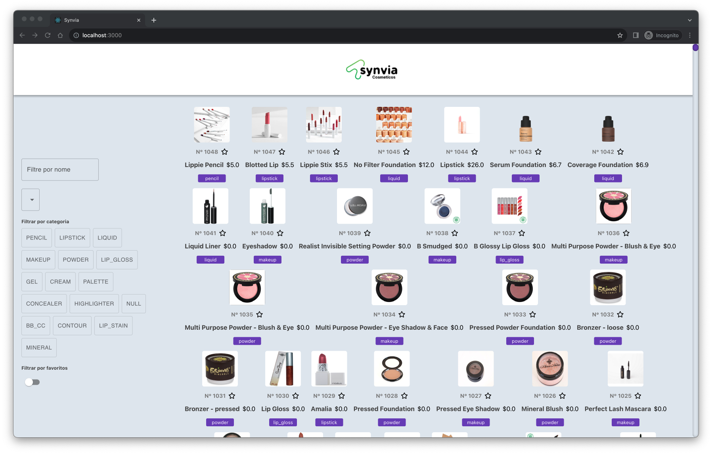

# Desafio Synvia

Projeto criado como desafio para vaga de desenvolvedor.



## Para iniciar o projeto

### Requisitos

- Node v20.x

### Executando

```
$ npm install
$ npm start
```

Abra o browser em [http://localhost:3000](http://localhost:3000).

### Testes

```
$ npm test
```
